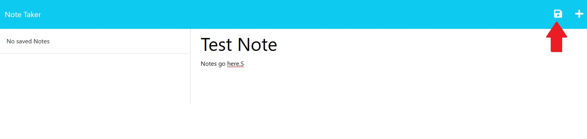
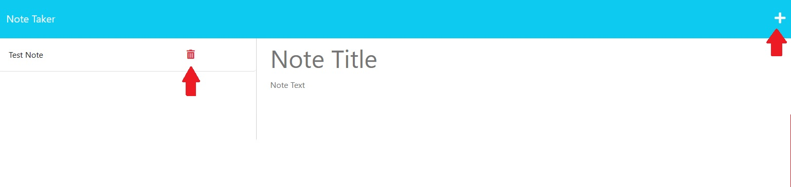

# Module 11 Note Taker Express

This project takes provided front end and tasked us with setting up the backed using express.  The app takes in simple notes with a title and the note itself and saves it do a database.  It reads from the database and displays past notes on the screen with the ability to delete those past notes.
## Usage/Examples

Visit https://notestakerexpress.herokuapp.com/ to launch the app.

Once you land on the home page click the get started button in the center of your screen to go to the note input page.  

Note Title and Note Text are placeholders for input fields where you will enter your note title and text.  

Once you have valid inputs in both fields a save disk icon will appear in the top right corner:  

Clicking this icon will save your note to the note database.  Once saved it will be displayed on the left.  From here you can click on the displayed note title to have the note displayed fully, click the trashcan to delete the note, or click the + icon to return the inputs to their default state so you can add a new note.

## Installation

This App does not require installation.
    
## Lessons Learned

This project was a mess at first.  I was struggling to understand what in the world was happening with express and routes.  This is actually the second repo I made for this project.  In the first one I was going back and forth between it working and not for a long time until eventually, because I didn't fully understand what I was doing, I broke it for good.  I think what had happened in hindsight was that I had a small error somewhere but all my attempts to get the routes to work properly just piled errors on errors until eventually I rage deleted the entire repo.  

After watching some YouTube videos that explained basic routing and having chatGPT explain to me in plain english what certain lines from the module activities were actually doing I finally understood.  

When I recreated the repo and wrote the code following templates from class activities and combined with a better understanding of what I was doing it worked literally on the first try.  I understood why I was telling the app to use /api for fetch requests(because thats how they were labeled in the provided JS).  I understood why I was using different JS for different routes, and why I was exporting and requiring them in different places.  I understand that my server.js file exists to simultaneously handle GETS for different HTML pages and also to tell the app how fetch requests are handled in different ways by using different JS files that I wrote.

Truth be told I was lost in the in class explanations of express and routing and server.js etc etc.  Seeing it in action now with help from tutorials has been the biggest lightbulb moment for me thus far.

## License

[MIT](https://choosealicense.com/licenses/mit/)

## Acknowledgements

https://readme.so

ChatGPT for explaining individual lines of code.

[Roberts Dev Call](https://youtu.be/li7FzDHYZpc)

[web dev simplified](https://youtu.be/SccSCuHhOw0)

## 🔗 Links

